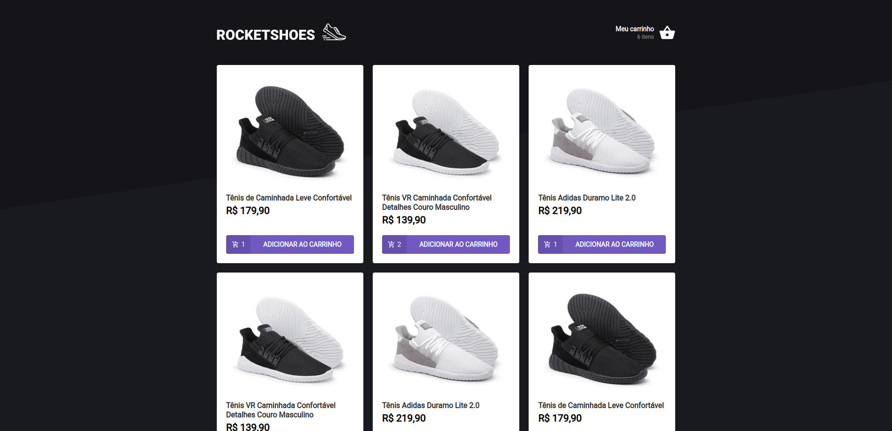
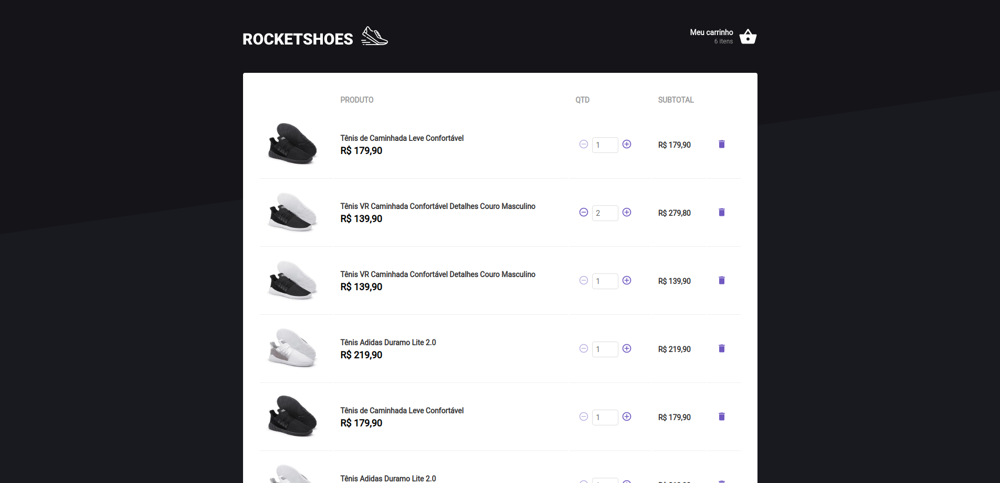

<h1 align="center">
    
</h1>

<h1 align="center">
    
</h1>


<h4 align="center">

[View demo](#-demonstration) · [Report bug](https://github.com/LeonardoCampello-dev/Rocket-shoes-challenge/issues)

</h4>

<h2> 📘 Index </h2>

- [👨‍🏫 About](#-about)
- [🚀 Technology](#-technology)
  - [📚 Libs](#-libs)
- [🎬 Demonstration](#-demonstration)
- [☕ Prerequisites](#-prerequisites)
- [🔧 Installing](#-installing)
- [💿 Using](#-using)
- [📮 Contributing](#-contributing)
- [🤟 Collaborators](#-collaborators)
  - [😎 Become a contributor](#-become-a-contributor)
- [📜 License](#-license)

## 👨‍🏫 About

RocketShoes was a challenge developed to practice Context API and custom hooks in React.

## 🚀 Technology

- [x] [TypeScript](https://www.typescriptlang.org/)
- [x] [React](https://github.com/facebook/react/)

### 📚 Libs

- [json-server](https://www.npmjs.com/package/json-server)
- [styled-components](https://styled-components.com/)
- [react-toastify](https://www.npmjs.com/package/react-toastify)


## 🎬 Demonstration

<p align='center'>
  
</p>

<p align='center'>
  
</p>


## ☕ Prerequisites

Before getting your hands dirty, make sure you meet the following requirements:

- [ ] Have a recent version of Node installed
- [ ] Have a recent version of Yarn installed (optional)

## 🔧 Installing

To install, follow the steps:

Clone the repository:

```bash
git clone https://github.com/LeonardoCampello-dev/Rocket-shoes-challenge.git

## If you are using a GitHub CLI, use the command:

gh repo clone LeonardoCampello-dev/Rocket-shoes-challenge
```

Install the dependencies:

```bash
yarn install

## or:

npm install
```

## 💿 Using

To use, follow the steps:

Run the project:

```bash
yarn dev

## or:

npm run dev
```

Run the fake API

```bash
yarn server

## or:

npm run server
```

## 📮 Contributing

If this is your first contribution, [see the following tutorial.](https://github.com/firstcontributions/first-contributions)

## 🤟 Collaborators

We thank the following developers who contributed:

<table>
  <tr>
    <td align="center">
      <a href="https://github.com/LeonardoCampello-dev">
         <br>
        <sub>
          <b>Leonardo Campello</b>
        </sub>
      </a>
    </td>
  </tr>
</table>

### 😎 Become a contributor

Would you like to be part of this project? Click [HERE](https://github.com/firstcontributions/first-contributions) and read the instructions to contribute.

## 📜 License

Made in 2020. This project is under the [MIT license.](./LICENSE)

<h2> Made with 💚 by Leonardo Campello </h2>